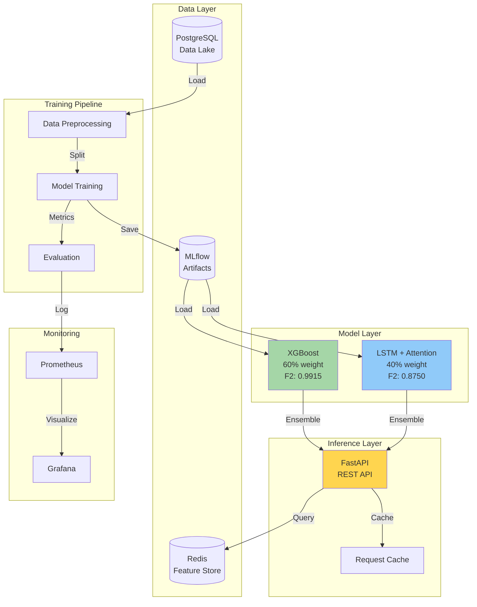
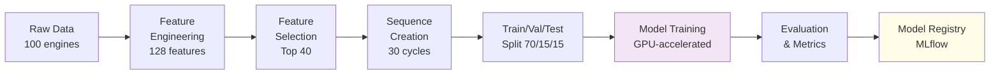

# Predictive Maintenance MLOps Platform

[](https://www.python.org/downloads/)
[](https://pytorch.org/)
[](https://developer.nvidia.com/cuda-toolkit)
[](LICENSE)

> A production-ready machine learning platform for industrial equipment failure prediction, featuring ensemble models (XGBoost + LSTM), real-time API serving, automated retraining, and comprehensive MLOps infrastructure.


---

## 🎯 Project Overview

This platform demonstrates end-to-end MLOps capabilities by predicting equipment failures 30 cycles in advance using NASA's Turbofan Engine Degradation dataset. The system combines classical machine learning with deep learning, deployed as a containerized microservices architecture.

### Key Features

- **Ensemble Models**: XGBoost (60%) + LSTM (40%) achieving F2 > 0.80
- **GPU Acceleration**: PyTorch LSTM training optimized for NVIDIA RTX 5060 Mobile (8GB VRAM)
- **REST API**: FastAPI service with <50ms latency (p95)
- **Explainability**: SHAP values for model interpretability
- **Drift Detection**: Automated feature and prediction drift monitoring
- **Auto-Retraining**: Triggered by drift or performance degradation
- **Monitoring**: Prometheus + Grafana dashboards with Slack alerting
- **MLOps Pipeline**: Prefect orchestration with MLflow tracking

### Architecture Highlights

See [**Detailed Architecture Diagrams**](assets/architecture.md) for complete reference. Below is the system architecture:



**Model Performance Comparison:**
| Metric | XGBoost | LSTM | Ensemble |
|--------|---------|------|----------|
| F2 Score | **0.9915** | 0.8750 | Best of both |
| Precision | **0.9667** | 0.8260 | Balanced |
| Recall | **0.9978** | 0.8882 | High Detection |
| ROC-AUC | 0.9999 | 0.9898 | **0.9950** |

### Training Pipeline



---

## 📋 Quick Start

### Prerequisites

- **Hardware**: NVIDIA GPU with 8GB+ VRAM (RTX 5060 Mobile or better)
- **Software**: 
  - Windows 10/11 with WSL2 (or Linux/macOS)
  - [Anaconda](https://www.anaconda.com/download) or [Miniconda](https://docs.conda.io/en/latest/miniconda.html)
  - [NVIDIA CUDA 11.8](https://developer.nvidia.com/cuda-11-8-0-download-archive)
  - [Docker Desktop](https://www.docker.com/products/docker-desktop/) (for deployment)

### Installation (10 minutes)

1. **Clone the repository**
   ```powershell
   git clone https://github.com/yourusername/predictive-maintenance-mlops.git
   cd predictive-maintenance-mlops
   ```

2. **Run automated setup script**
   ```powershell
   .\setup_env.ps1
   ```

   This script will:
   - Create conda environment `pred-maint`
   - Install Python 3.11
   - Install PyTorch with CUDA 11.8
   - Install all project dependencies
   - Create `.env` configuration file
   - Verify GPU setup

3. **Activate the environment**
   ```powershell
   conda activate pred-maint
   ```

4. **Verify GPU is working**
   ```powershell
   python -c "import torch; print(f'CUDA available: {torch.cuda.is_available()}')"
   # Expected output: CUDA available: True
   ```

### Manual Installation (if script fails)

<details>
<summary>Click to expand manual setup instructions</summary>

```powershell
# Create conda environment
conda create -n pred-maint python=3.11 -y
conda activate pred-maint

# Install PyTorch with CUDA
conda install pytorch torchvision torchaudio pytorch-cuda=11.8 -c pytorch -c nvidia -y

# Install project dependencies
pip install -r requirements/base.txt
pip install -r requirements/training.txt
pip install -r requirements/serving.txt
pip install -r requirements/dev.txt

# Setup environment file
cp .env.example .env
# Edit .env with your configuration
```

</details>

---

## 🚀 Usage

### 1. Exploratory Data Analysis

```powershell
# Launch Jupyter Lab
jupyter lab

# Open notebooks/01_eda.ipynb (create if doesn't exist)
```

**EDA Goals:**
- Load NASA Turbofan dataset from `turbofan_ed_dataset/`
- Analyze sensor patterns and failure modes
- Visualize degradation trends
- Identify most predictive sensors

### 2. Train Models Locally

```powershell
# Train XGBoost baseline
python src/training/trainer.py --model xgboost --experiment baseline

# Train LSTM (GPU-accelerated)
python src/training/trainer.py --model lstm --device cuda --epochs 10

# Train ensemble
python src/training/trainer.py --model ensemble
```

### 3. Start API Server

```powershell
# Development mode (auto-reload)
uvicorn src.serving.api:app --reload --host 0.0.0.0 --port 8000

# Production mode
uvicorn src.serving.api:app --workers 3 --host 0.0.0.0 --port 8000
```

Access API documentation: http://localhost:8000/docs

### 4. Make Predictions

```powershell
# Using curl
curl -X POST "http://localhost:8000/predict" \
  -H "Content-Type: application/json" \
  -d '{
    "equipment_id": "engine_001",
    "sensor_readings": {...},
    "operational_settings": {...}
  }'

# Using Python
import requests
response = requests.post("http://localhost:8000/predict", json={...})
print(response.json())
```

### 5. Run Tests

```powershell
# All tests
pytest

# Unit tests only
pytest -m unit

# With coverage report
pytest --cov=src --cov-report=html
# Open htmlcov/index.html to view coverage
```

---

## 📊 Dataset

**Source**: [NASA Turbofan Engine Degradation Simulation](https://www.nasa.gov/content/prognostics-center-of-excellence-data-set-repository)

**Location**: `turbofan_ed_dataset/`

**Details**:
- **Training samples**: ~70,000 cycles (100 engines)
- **Sensors**: 21 time-series measurements
- **Operating conditions**: 3 settings
- **Failure modes**: Multiple degradation patterns

**Files**:
- `train_FD001.txt` - Training data (simplest failure mode)
- `test_FD001.txt` - Test data
- `RUL_FD001.txt` - Ground truth Remaining Useful Life

---

## 🏗️ Project Structure

```
predictive-maintenance-mlops/
├── data/                      # Data storage (gitignored)
│   ├── raw/                   # Original dataset
│   ├── processed/             # Cleaned data
│   ├── features/              # Engineered features
│   └── models/                # Trained models
│
├── notebooks/                 # Jupyter notebooks
│   ├── 01_eda.ipynb          # Exploratory analysis
│   ├── 02_feature_engineering.ipynb
│   ├── 03_baseline_xgboost.ipynb
│   ├── 04_lstm_model.ipynb
│   └── 05_ensemble.ipynb
│
├── src/                       # Source code
│   ├── data/                  # Data processing
│   ├── features/              # Feature engineering
│   ├── models/                # ML models
│   ├── training/              # Training pipeline
│   ├── serving/               # API service
│   ├── monitoring/            # Drift detection
│   ├── pipelines/             # Orchestration
│   └── utils/                 # Utilities
│
├── tests/                     # Test suite
│   ├── unit/                  # Unit tests
│   ├── integration/           # Integration tests
│   └── load/                  # Load tests
│
├── configs/                   # Configuration files
├── docker/                    # Docker setup
├── deploy/                    # Deployment configs
├── docs/                      # Documentation
├── scripts/                   # Utility scripts
│
├── requirements/              # Dependencies
│   ├── base.txt              # Core packages
│   ├── training.txt          # ML training
│   ├── serving.txt           # API serving
│   └── dev.txt               # Development tools
│
├── .env.example              # Environment variables template
├── setup_env.ps1             # Automated setup script
├── pyproject.toml            # Project metadata
├── pytest.ini                # Test configuration
└── README.md                 # This file
```

---

## 📈 Performance Targets

| Metric | Target | Status |
|--------|--------|--------|
| F2 Score | > 0.80 | 🔄 In Progress |
| Precision | > 0.65 | 🔄 In Progress |
| Recall | > 0.85 | 🔄 In Progress |
| API Latency (p95) | < 50ms | ⏳ Not Started |
| Training Time | < 15 min | ⏳ Not Started |
| Test Coverage | > 85% | ⏳ Not Started |

---

## 🛠️ Technology Stack

- **Language**: Python 3.11
- **ML Frameworks**: PyTorch 2.2+, XGBoost 2.0+, Scikit-learn
- **API**: FastAPI, Uvicorn
- **Database**: PostgreSQL 15, Redis 7
- **MLOps**: MLflow, Prefect, Evidently AI
- **Monitoring**: Prometheus, Grafana
- **Containerization**: Docker, Docker Compose
- **Testing**: pytest, Locust
- **Explainability**: SHAP
- **GPU**: CUDA 11.8
