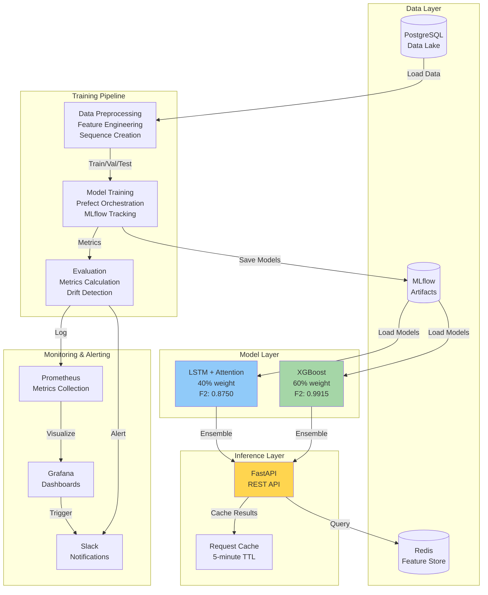
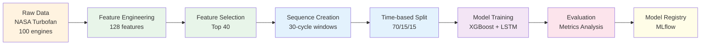
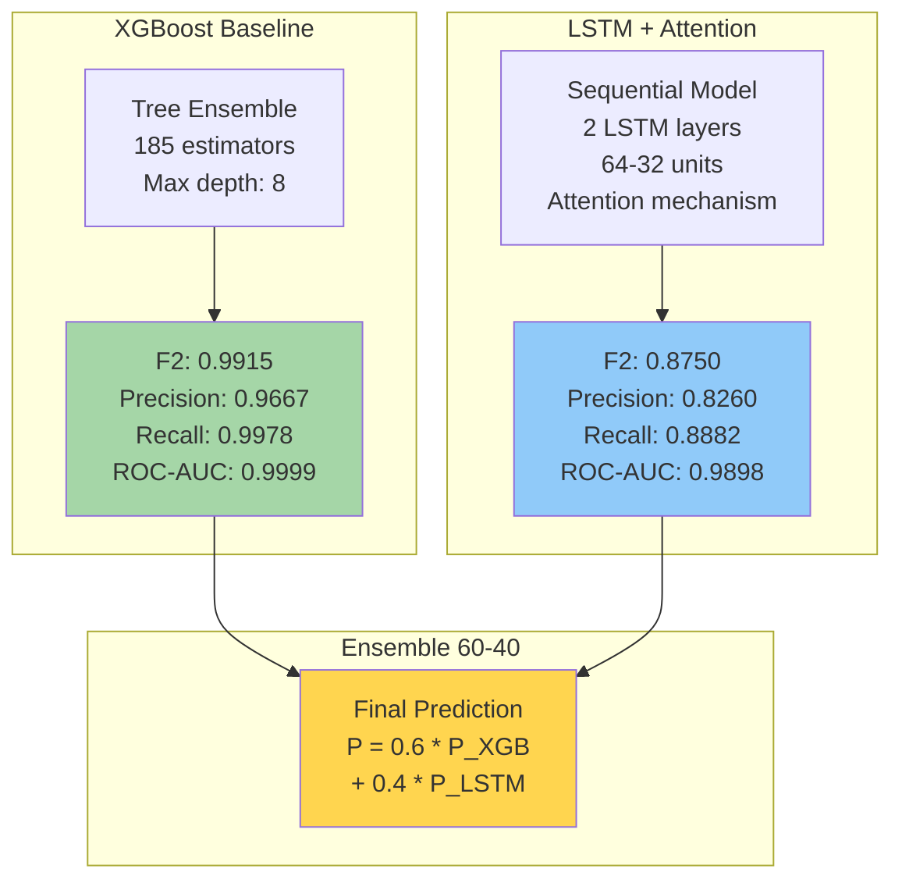
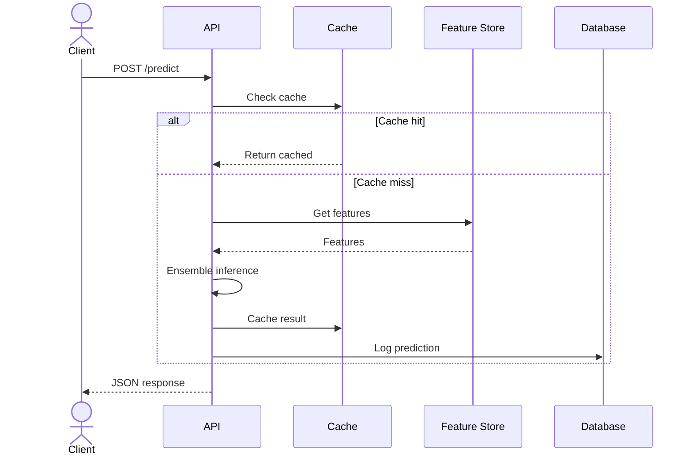
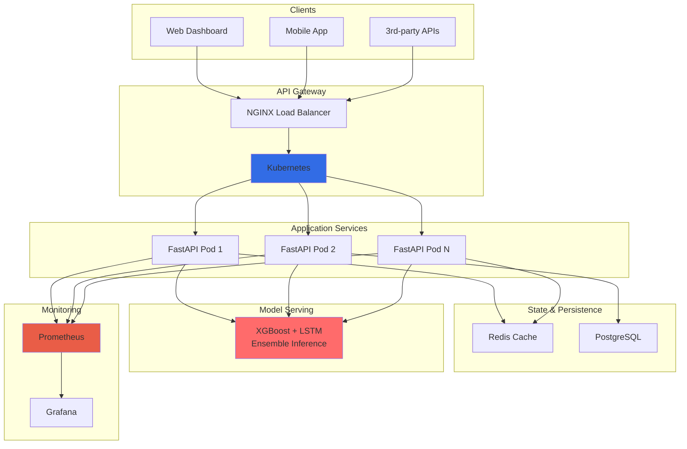

# MLOps Architecture Diagram

## System Architecture

```mermaid
graph TB
    subgraph DL["Data Layer"]
        DB[(PostgreSQL<br/>Data Lake)]
        FS[(Redis<br/>Feature Store)]
        MLFLOW[(MLflow<br/>Artifacts)]
    end
    
    subgraph ML["Model Layer"]
        XGB["XGBoost<br/>60% weight<br/>F2: 0.9915"]
        LSTM["LSTM + Attention<br/>40% weight<br/>F2: 0.8750"]
    end
    
    subgraph IL["Inference Layer"]
        API["FastAPI<br/>REST API"]
        CACHE["Request Cache<br/>5-minute TTL"]
    end
    
    subgraph TP["Training Pipeline"]
        PREPROCESS["Data Preprocessing<br/>Feature Engineering<br/>Sequence Creation"]
        TRAIN["Model Training<br/>Prefect Orchestration<br/>MLflow Tracking"]
        EVAL["Evaluation<br/>Metrics Calculation<br/>Drift Detection"]
    end
    
    subgraph MA["Monitoring & Alerting"]
        PROM["Prometheus<br/>Metrics Collection"]
        GRAFANA["Grafana<br/>Dashboards"]
        SLACK["Slack<br/>Notifications"]
    end
    
    DB -->|Load Data| PREPROCESS
    PREPROCESS -->|Train/Val/Test| TRAIN
    TRAIN -->|Save Models| MLFLOW
    MLFLOW -->|Load Models| XGB
    MLFLOW -->|Load Models| LSTM
    XGB -->|Ensemble| API
    LSTM -->|Ensemble| API
    API -->|Cache Results| CACHE
    API -->|Query| FS
    TRAIN -->|Metrics| EVAL
    EVAL -->|Log| PROM
    PROM -->|Visualize| GRAFANA
    EVAL -->|Alert| SLACK
    GRAFANA -->|Trigger| SLACK

    style XGB fill:#A5D6A7
    style LSTM fill:#90CAF9
    style API fill:#FFD54F
```

## Training Pipeline

```mermaid
graph LR
    A["Raw Data<br/>NASA Turbofan<br/>100 engines"] 
    B["Feature Engineering<br/>128 features"]
    C["Feature Selection<br/>Top 40"]
    D["Sequence Creation<br/>30-cycle windows"]
    E["Time-based Split<br/>70/15/15"]
    F["Model Training<br/>XGBoost + LSTM"]
    G["Evaluation<br/>Metrics Analysis"]
    H["Model Registry<br/>MLflow"]
    
    A-->B-->C-->D-->E-->F-->G-->H
    
    style A fill:#FFF3E0
    style B fill:#E8F5E9
    style C fill:#E8F5E9
    style D fill:#E3F2FD
    style E fill:#E3F2FD
    style F fill:#F3E5F5
    style G fill:#FCE4EC
    style H fill:#FFFDE7
```

## Model Comparison

```mermaid
graph TB
    subgraph X["XGBoost Baseline"]
        XGB_ARCH["Tree Ensemble<br/>185 estimators<br/>Max depth: 8"]
        XGB_PERF["F2: 0.9915<br/>Precision: 0.9667<br/>Recall: 0.9978<br/>ROC-AUC: 0.9999"]
    end
    
    subgraph L["LSTM + Attention"]
        LSTM_ARCH["Sequential Model<br/>2 LSTM layers<br/>64-32 units<br/>Attention mechanism"]
        LSTM_PERF["F2: 0.8750<br/>Precision: 0.8260<br/>Recall: 0.8882<br/>ROC-AUC: 0.9898"]
    end
    
    subgraph E["Ensemble 60-40"]
        ENS["Final Prediction<br/>P = 0.6 * P_XGB<br/>+ 0.4 * P_LSTM"]
    end
    
    XGB_ARCH-->XGB_PERF
    LSTM_ARCH-->LSTM_PERF
    
    XGB_PERF-->ENS
    LSTM_PERF-->ENS
    
    style XGB_PERF fill:#A5D6A7
    style LSTM_PERF fill:#90CAF9
    style ENS fill:#FFD54F
```

## Data Flow

```mermaid
sequenceDiagram
    actor Client
    participant API
    participant Cache
    participant FS as Feature Store
    participant DB as Database
    
    Client->>API: POST /predict
    API->>Cache: Check cache
    alt Cache hit
        Cache-->>API: Return cached
    else Cache miss
        API->>FS: Get features
        FS-->>API: Features
        API->>API: Ensemble inference
        API->>Cache: Cache result
        API->>DB: Log prediction
    end
    API-->>Client: JSON response
```

## Deployment Architecture

```mermaid
graph TB
    subgraph Clients["Clients"]
        WEB["Web Dashboard"]
        MOBILE["Mobile App"]
        API_C["3rd-party APIs"]
    end
    
    subgraph Gateway["API Gateway"]
        NGINX["NGINX Load Balancer"]
        K8S["Kubernetes"]
    end
    
    subgraph Services["Application Services"]
        API1["FastAPI Pod 1"]
        API2["FastAPI Pod 2"]
        API3["FastAPI Pod N"]
    end
    
    subgraph Data["State & Persistence"]
        REDIS["Redis Cache"]
        POSTGRES["PostgreSQL"]
    end
    
    subgraph Models["Model Serving"]
        MLSERVER["XGBoost + LSTM<br/>Ensemble Inference"]
    end
    
    subgraph Monitoring["Monitoring"]
        PROM["Prometheus"]
        GRAFANA["Grafana"]
    end
    
    WEB-->NGINX
    MOBILE-->NGINX
    API_C-->NGINX
    NGINX-->K8S
    K8S-->API1
    K8S-->API2
    K8S-->API3
    API1-->MLSERVER
    API2-->MLSERVER
    API3-->MLSERVER
    API1-->REDIS
    API2-->POSTGRES
    API3-->REDIS
    API1-->PROM
    API2-->PROM
    API3-->PROM
    PROM-->GRAFANA
    
    style K8S fill:#326CE5
    style MLSERVER fill:#FF6B6B
    style PROM fill:#E95D47
```
