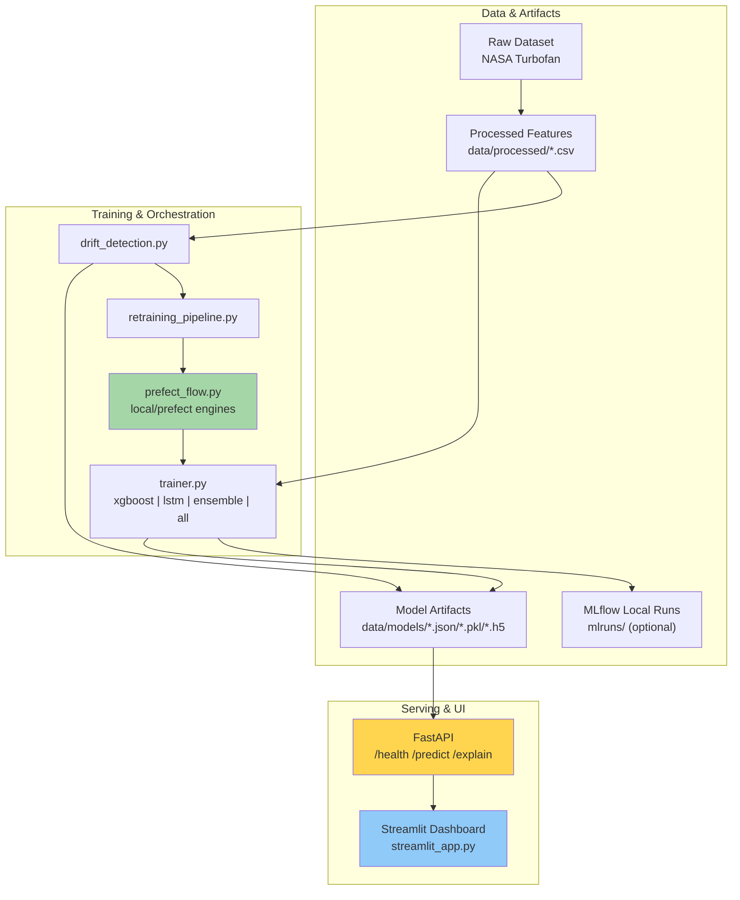
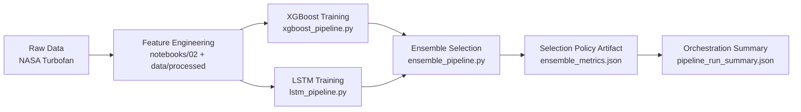
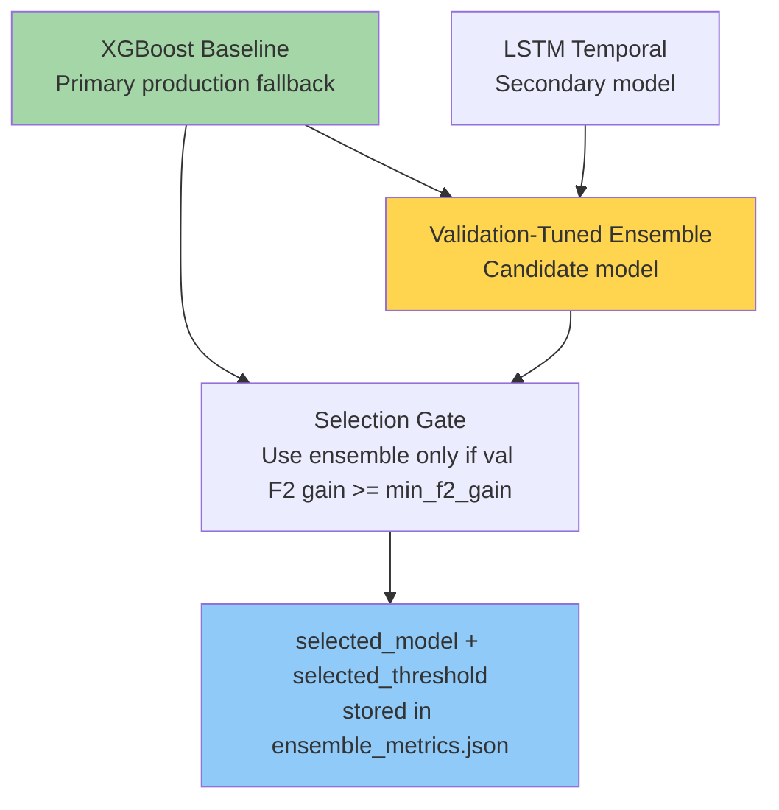
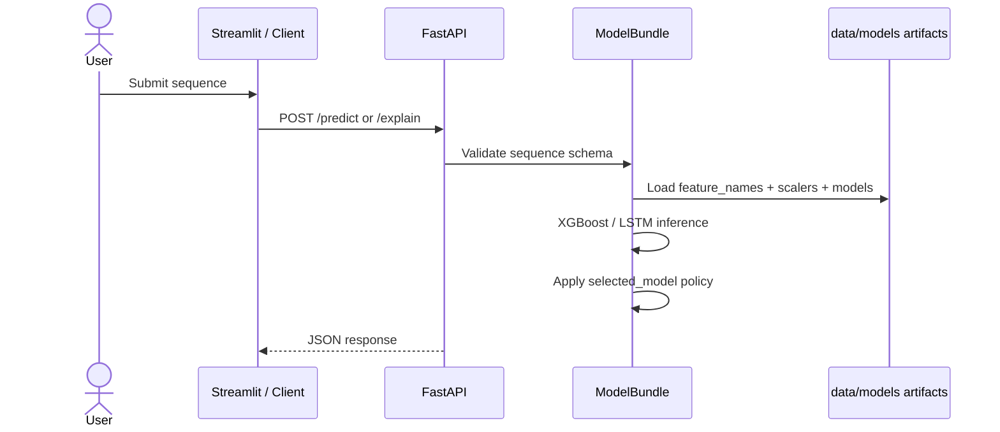
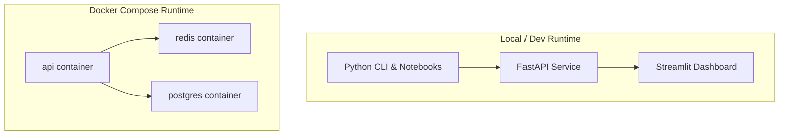

# Current MLOps Architecture

## System Architecture (Implemented)

## Training Pipeline (Implemented)

## Model Comparison and Selection Policy (Current)

## Inference Data Flow (Current)

## Deployment Architecture (Current)

