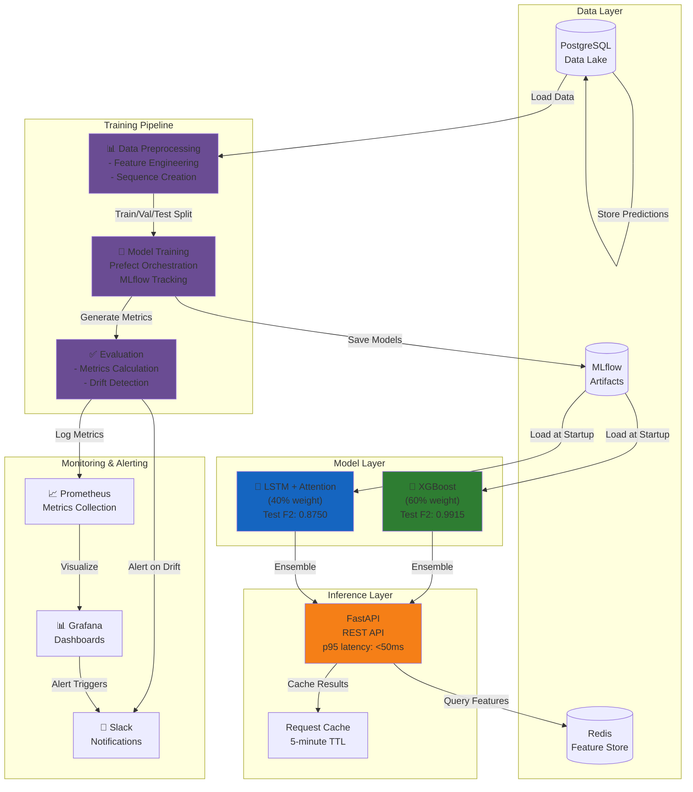
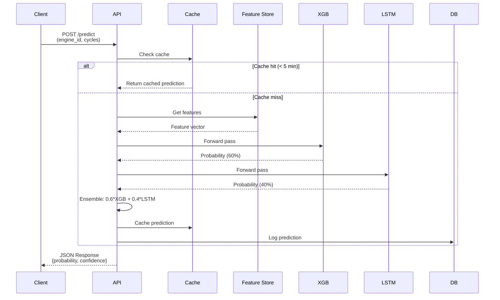
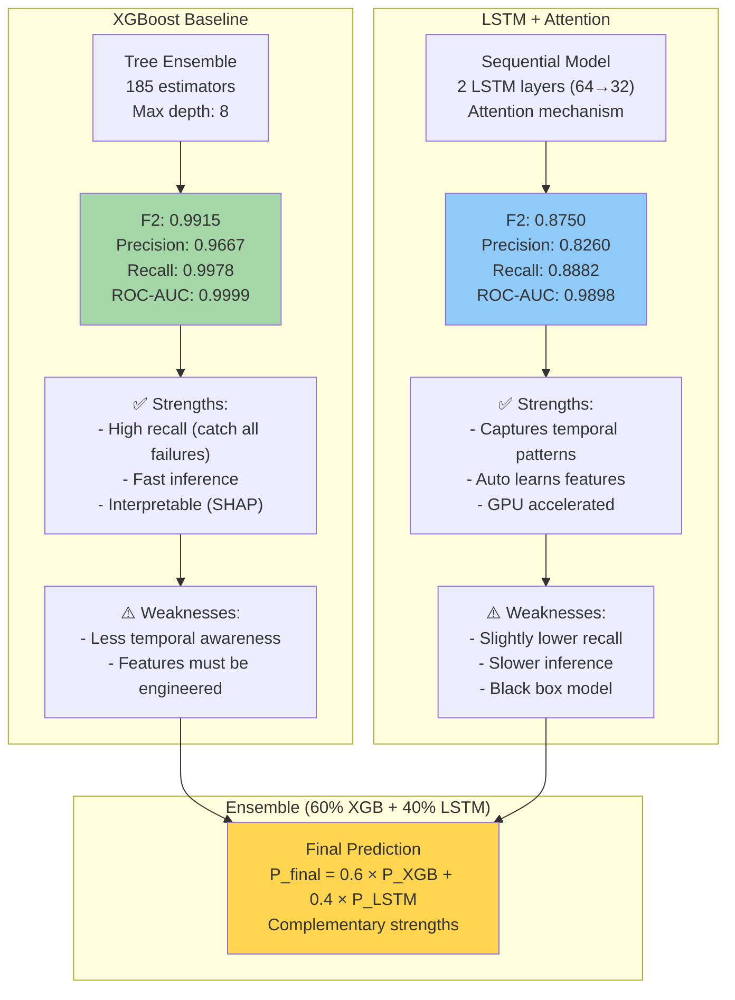
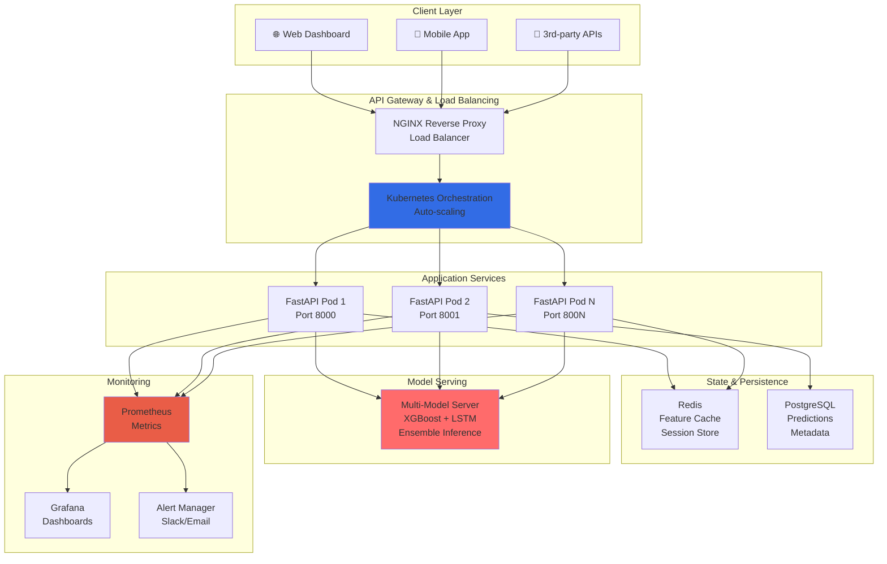

# MLOps Architecture Diagram

## System Architecture

```mermaid
graph TB
    subgraph "Data Layer"
        DB[(PostgreSQL<br/>Data Lake)]
        FS[(Redis<br/>Feature Store)]
        MLFLOW[(MLflow<br/>Artifacts)]
    end
    
    subgraph "Model Layer"
        XGB["🌳 XGBoost<br/>(60% weight)<br/>Test F2: 0.9915"]
        LSTM["🔄 LSTM + Attention<br/>(40% weight)<br/>Test F2: 0.8750"]
    end
    
    subgraph "Inference Layer"
        API["FastAPI<br/>REST API<br/>p95 latency: <50ms"]
        CACHE["Request Cache<br/>5-minute TTL"]
    end
    
    subgraph "Training Pipeline"
        PREPROCESS["📊 Data Preprocessing<br/>- Feature Engineering<br/>- Sequence Creation"]
        TRAIN["🎯 Model Training<br/>Prefect Orchestration<br/>MLflow Tracking"]
        EVAL["✅ Evaluation<br/>- Metrics Calculation<br/>- Drift Detection"]
    end
    
    subgraph "Monitoring & Alerting"
        PROM["📈 Prometheus<br/>Metrics Collection"]
        GRAFANA["📊 Grafana<br/>Dashboards"]
        SLACK["🚨 Slack<br/>Notifications"]
    end
    
    DB -->|Load Data| PREPROCESS
    PREPROCESS -->|Train/Val/Test Split| TRAIN
    TRAIN -->|Save Models| MLFLOW
    MLFLOW -->|Load at Startup| XGB
    MLFLOW -->|Load at Startup| LSTM
    XGB -->|Ensemble| API
    LSTM -->|Ensemble| API
    API -->|Cache Results| CACHE
    API -->|Query Features| FS
    DB -->|Store Predictions| DB
    TRAIN -->|Generate Metrics| EVAL
    EVAL -->|Log Metrics| PROM
    PROM -->|Visualize| GRAFANA
    EVAL -->|Alert on Drift| SLACK
    GRAFANA -->|Alert Triggers| SLACK

    style XGB fill:#2E7D32
    style LSTM fill:#1565C0
    style API fill:#F57F17
    style PREPROCESS fill:#6A4C93
    style TRAIN fill:#6A4C93
    style EVAL fill:#6A4C93
```

## Data Flow

```mermaid
sequenceDiagram
    participant Client
    participant API
    participant Cache
    participant FS as Feature Store
    participant XGB
    participant LSTM
    participant DB

    Client->>API: POST /predict<br/>(engine_id, cycles)
    API->>Cache: Check cache
    alt Cache hit (< 5 min)
        Cache-->>API: Return cached prediction
    else Cache miss
        API->>FS: Get features
        FS-->>API: Feature vector
        API->>XGB: Forward pass
        XGB-->>API: Probability (60%)
        API->>LSTM: Forward pass
        LSTM-->>API: Probability (40%)
        API->>API: Ensemble: 0.6*XGB + 0.4*LSTM
        API->>Cache: Cache prediction
        API->>DB: Log prediction
    end
    API-->>Client: JSON Response<br/>{probability, confidence}
```

## Training Pipeline

```mermaid
graph LR
    A["🔄 Raw Data<br/>NASA Turbofan<br/>100 engines"] 
    B["🔧 Feature Engineering<br/>128 features<br/>60 rolling + 15 lag<br/>+ 15 ROC + 10 domain"]
    C["📊 Feature Selection<br/>Top 40 by correlation"]
    D["⏱️ Sequence Creation<br/>30-cycle windows<br/>Temporal patterns"]
    E["✂️ Time-based Split<br/>70% train<br/>15% val / 15% test"]
    F["📈 Model Training<br/>XGBoost: Optuna tuning<br/>LSTM: GPU-accelerated"]
    G["✅ Evaluation<br/>F2, Precision, Recall<br/>ROC-AUC, Confusion Matrix"]
    H["💾 Model Registry<br/>MLflow artifacts<br/>Version control"]
    
    A-->B-->C-->D-->E-->F-->G-->H
    
    style A fill:#FFF3E0
    style B fill:#E8F5E9
    style C fill:#E8F5E9
    style D fill:#E3F2FD
    style E fill:#E3F2FD
    style F fill:#F3E5F5
    style G fill:#FCE4EC
    style H fill:#FFFDE7
```

## Model Comparison

```mermaid
graph TB
    subgraph "XGBoost Baseline"
        XGB_ARCH["Tree Ensemble<br/>185 estimators<br/>Max depth: 8"]
        XGB_PERF["F2: 0.9915<br/>Precision: 0.9667<br/>Recall: 0.9978<br/>ROC-AUC: 0.9999"]
        XGB_STR["✅ Strengths:<br/>- High recall (catch all failures)<br/>- Fast inference<br/>- Interpretable (SHAP)"]
        XGB_WK["⚠️ Weaknesses:<br/>- Less temporal awareness<br/>- Features must be engineered"]
    end
    
    subgraph "LSTM + Attention"
        LSTM_ARCH["Sequential Model<br/>2 LSTM layers (64→32)<br/>Attention mechanism"]
        LSTM_PERF["F2: 0.8750<br/>Precision: 0.8260<br/>Recall: 0.8882<br/>ROC-AUC: 0.9898"]
        LSTM_STR["✅ Strengths:<br/>- Captures temporal patterns<br/>- Auto learns features<br/>- GPU accelerated"]
        LSTM_WK["⚠️ Weaknesses:<br/>- Slightly lower recall<br/>- Slower inference<br/>- Black box model"]
    end
    
    subgraph "Ensemble (60% XGB + 40% LSTM)"
        ENS["Final Prediction<br/>P_final = 0.6 × P_XGB + 0.4 × P_LSTM<br/>Complementary strengths"]
    end
    
    XGB_ARCH-->XGB_PERF
    XGB_PERF-->XGB_STR
    XGB_STR-->XGB_WK
    
    LSTM_ARCH-->LSTM_PERF
    LSTM_PERF-->LSTM_STR
    LSTM_STR-->LSTM_WK
    
    XGB_WK-->ENS
    LSTM_WK-->ENS
    
    style XGB_PERF fill:#A5D6A7
    style LSTM_PERF fill:#90CAF9
    style ENS fill:#FFD54F
```

## Deployment Architecture

```mermaid
graph TB
    subgraph "Client Layer"
        WEB["🌐 Web Dashboard"]
        MOBILE["📱 Mobile App"]
        API_CLIENT["🔌 3rd-party APIs"]
    end
    
    subgraph "API Gateway & Load Balancing"
        NGINX["NGINX Reverse Proxy<br/>Load Balancer"]
        K8S["Kubernetes Orchestration<br/>Auto-scaling"]
    end
    
    subgraph "Application Services"
        API1["FastAPI Pod 1<br/>Port 8000"]
        API2["FastAPI Pod 2<br/>Port 8001"]
        API3["FastAPI Pod N<br/>Port 800N"]
    end
    
    subgraph "State & Persistence"
        REDIS["Redis<br/>Feature Cache<br/>Session Store"]
        POSTGRES["PostgreSQL<br/>Predictions<br/>Metadata"]
    end
    
    subgraph "Model Serving"
        MLSERVER["Multi-Model Server<br/>XGBoost + LSTM<br/>Ensemble Inference"]
    end
    
    subgraph "Monitoring"
        PROM_SVC["Prometheus<br/>Metrics"]
        GRAFANA_SVC["Grafana<br/>Dashboards"]
        ALERT["Alert Manager<br/>Slack/Email"]
    end
    
    WEB-->NGINX
    MOBILE-->NGINX
    API_CLIENT-->NGINX
    NGINX-->K8S
    K8S-->API1
    K8S-->API2
    K8S-->API3
    API1-->MLSERVER
    API2-->MLSERVER
    API3-->MLSERVER
    API1-->REDIS
    API2-->POSTGRES
    API3-->REDIS
    API1-->PROM_SVC
    API2-->PROM_SVC
    API3-->PROM_SVC
    PROM_SVC-->GRAFANA_SVC
    PROM_SVC-->ALERT
    
    style K8S fill:#326CE5
    style MLSERVER fill:#FF6B6B
    style PROM_SVC fill:#E95D47
```
